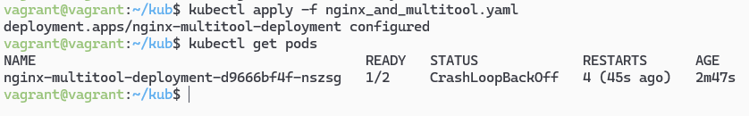
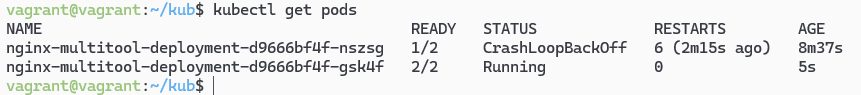
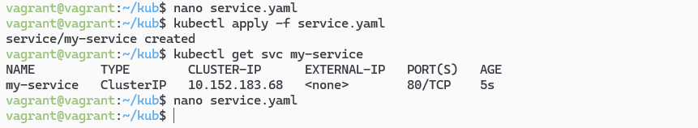
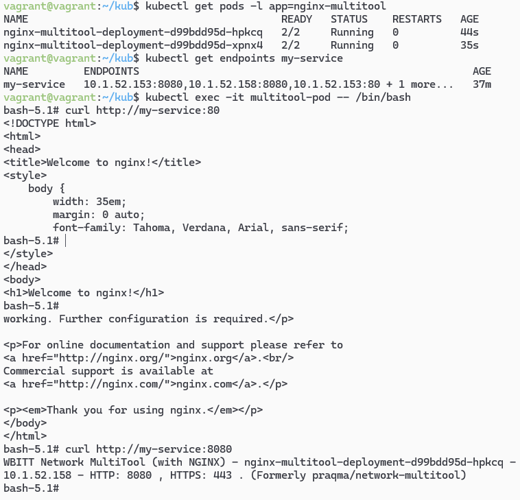
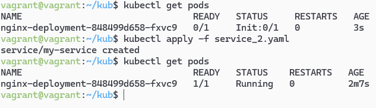

# Домашнее задание к занятию «Запуск приложений в K8S»- Михалёв Сергей

### Цель задания

В тестовой среде для работы с Kubernetes, установленной в предыдущем ДЗ, необходимо развернуть Deployment с приложением, состоящим из нескольких контейнеров, и масштабировать его.

------

### Инструменты и дополнительные материалы, которые пригодятся для выполнения задания

1. [Описание](https://kubernetes.io/docs/concepts/workloads/controllers/deployment/) Deployment и примеры манифестов.
2. [Описание](https://kubernetes.io/docs/concepts/workloads/pods/init-containers/) Init-контейнеров.
3. [Описание](https://github.com/wbitt/Network-MultiTool) Multitool.

------

### Задание 1. Создать Deployment и обеспечить доступ к репликам приложения из другого Pod

1. Создать Deployment приложения, состоящего из двух контейнеров — nginx и multitool. Решить возникшую ошибку.
2. После запуска увеличить количество реплик работающего приложения до 2.
3. Продемонстрировать количество подов до и после масштабирования.
4. Создать Service, который обеспечит доступ до реплик приложений из п.1.
5. Создать отдельный Pod с приложением multitool и убедиться с помощью `curl`, что из пода есть доступ до приложений из п.1.

**Решение**

Создал манифест [nginx_and_multitool.yaml](manifests/nginx_and_multitool.yaml). Запустил. 
В списке только один под. 
 

Использовал команду `kubectl scale deployment nginx-multitool-deployment --replicas=2` для увеличения количество реплик работающего приложения до 2. 
В списке два пода. 
 

Создал манифест [service.yaml](manifests/service.yaml). Запустил. 
 

Использую манифест [multitool-pod.yaml](manifests/multitool-pod.yaml) для проверки досмтупа к приложению. 
Проверил работоспособность nginx: `curl http://my-service:80` и multitool: `curl http://my-service:8080`.  
 

------

### Задание 2. Создать Deployment и обеспечить старт основного контейнера при выполнении условий

1. Создать Deployment приложения nginx и обеспечить старт контейнера только после того, как будет запущен сервис этого приложения.
2. Убедиться, что nginx не стартует. В качестве Init-контейнера взять busybox.
3. Создать и запустить Service. Убедиться, что Init запустился.
4. Продемонстрировать состояние пода до и после запуска сервиса.

**Решение**

Создал манифест [nginx-deployment.yaml](manifests/nginx-deployment.yaml) с initContainers. 
Создал простой файл с описанием сервиса [service_2.yaml](manifests/service_2.yaml). 
До запуска сервиса под находился в состоянии `Init:0/1`.  
 
 

------
